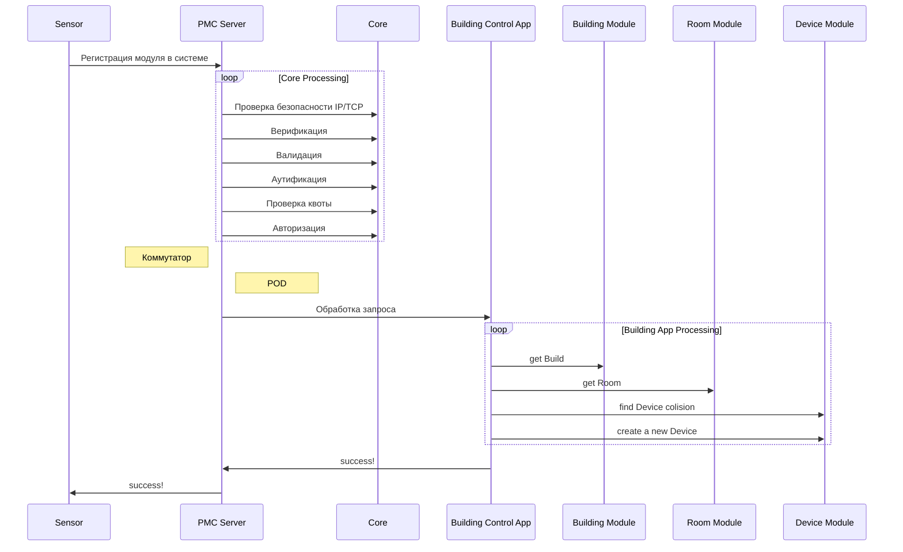
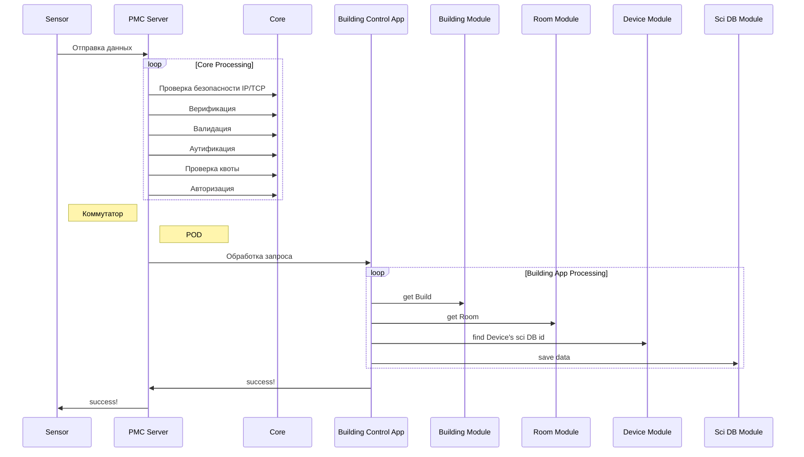

# in-building room universal sensor unit

> esp32 Аппаратно-Программная Платформа для Собора Показаний Датчиков и Выполнения Дифектории по Управляющему Шаблону Автоматиаций Умных

## Протокол связи

### Регистрация модуля в системе

Для регистрации нового аппаратного модуля в системе выполняется отправка следующего сообщения:

```json
{
  "version": "0.1.0",
  "system": {
    "verified": "tangwai salice",
    "type": "reg-device",
    "sender": {
      "type": "hardware",
      "code": "pmc-end-point-iot-system-5673",
      "id": null
    },
    "getter": {
      "type": "pmc-core-first-cluster",
      "topic": "pmc-reg"
    },
    "is_need_new_topic": true,
    "new_topics": [{
      "type": "pmc-end-point-iot-events",
      "name": "Домашний топик",
      "desc": "Топик включает в себя управление лампами, дверьми, окнами, кондиционером и получение данных о климате, а также присутствии",
      "ai_desc": "Топик для передачи данных между устройствами моего дома в городе Краснодар",
      "is_generate_topic_id": true,
      "topic_id": null
    }],
    "trace": [
      {
        "get_by": "",
        "send_to": [""],
        "get_at": "",
        "send_at": ""
      }
    ],
    "on_success": "",
    "on_failed": "",
    "on_warning": "",
    "on_validate_error": "",
    "on_error": "",
    "on_crash": ""
  },
  "data": {
    "devices": [
      {
        "type": "sensor", // "actor", "controller", "another"
        "name": "Датчик температуры и влажности",
        "pcb_name": "DHT11",
        "desc": "Датчик arduino для ",
        "ai_desc": "Датчик Arduino температуры и влажности DHT11",
        "images": [],
        "schematics": [],
        "is_generate_sensor_id": true,
        "sensor_id": null,
      }
    ],
    "device_connections": [
      {
        "from": "DEVICE ID",
        "to": "DEVICE ID",
        "type": "one-to-many",
        "desc": "Линия питания 5 Вольт"
      }
    ]
  }
}
```

##### Коды
`pmc-end-point-iot-system-5673` - код для конечных IoT устройств (подразумивается, что они не могут иметь после себя прямой связи с другими устройствами)
##### типы получателей
`pmc-core-first-cluster` - Данный тип получателя подразумивает что запрос будет передаваться по сети пока не дойдет до первого кластера ядра PMC.
##### Топики связи
`pmc-reg` - Данный топик связи подразумивает, что PMC будет регистрировать любое устроойство которое попало в систему после верификации, валидации, аунтификации, авторизации и регистрации.

Если устройство не имеет регистрации в системе, то его сообщения должны отправляться с <code>"id": null</code>

#### Жизненный цикл регистрации устройства в системе



### Отправка сообщения с показаниями сенсора

Каждый раз когда сенсор хочет отправить сообщение 

```json
{
  "version": "0.1.0",
  "system": {
    "sender": {
      "type": "hardware",
      "code": "pmc-end-point-iot-system-5673",
      "id": 4234123,
      "next_message_prediction": "1d" // Через какое время отправитель следующий раз произведет отправку (если не планируется то 0, если не известно то -1)
    },
    "getter": {
      "type": "pmc-core-first-cluster",
      "topic": "pmc-iot"
    },
    "trace": [
      {
        "get_by": "",
        "send_to": [""],
        "get_at": "",
        "send_at": ""
      }
    ],
    "on_success": "",
    "on_failed": "",
    "on_warning": "",
    "on_validate_error": "",
    "on_error": "",
    "on_crash": ""
  },
  "data": [
    {
      "device_id": "",
      "value": "",
      "date": ""
    }
  ]
}
```

#### Жизненный цикл отправки показаний с устройства в системе

