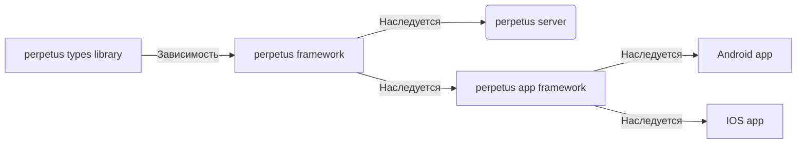

# 2. Perpetus Modulus Columus



## Порядок обработки кластера
<procedure title="Inject a procedure" id="inject-a-procedure">
    <step>
        <p>Start typing <code>procedure</code> and select a procedure type from the completion suggestions:</p>
        
    </step>
    <step>
        <p>Press <shortcut>Tab</shortcut> or <shortcut>Enter</shortcut> to insert the markup.</p>
    </step>
</procedure>

## 2.1. Apps

- 2.1.1 Building control
- 2.1.2 Dev kit

### Переводы
```json
{
  "version": "0.1.0",
  "system": {
    "verified": "tangwai salice",
    "type": "reg-translate",
    "sender": {
      "type": "hardware",
      "code": "pmc-external-access-085",
      "id": null,
      "auth": {
        "uuid": "UUID",
        "name": "Darius Weber",
        "is_admin": true,
        "jwt": "TOKEN"
      }
    },
    "getter": {
      "type": "pmc-core-first-cluster",
      "is_cascade": true,
      // Передаст данные после регистрации на другие кластеры
      "topic": "pmc-reg"
    },
    "trace": [
      {
        "get_by": "",
        "send_to": [""],
        "get_at": "",
        "send_at": ""
      }
    ],
    "on_success": "",
    "on_failed": "",
    "on_warning": "",
    "on_validate_error": "",
    "on_error": "",
    "on_crash": ""
  },
  "texts": [
    {
      "tag:": "pmc-ui-text-tangwai-salice",
      "name": "",
      "desc": "",
      "ai_desc": "",
      "translates": [
        {
          "lang": "en-EN",
          "text": "Tangwai Salice"
        },
        {
          "lang": "ru-RU",
          "text": "Тангвей Салис"
        }
      ]
    }
  ]

}
```
