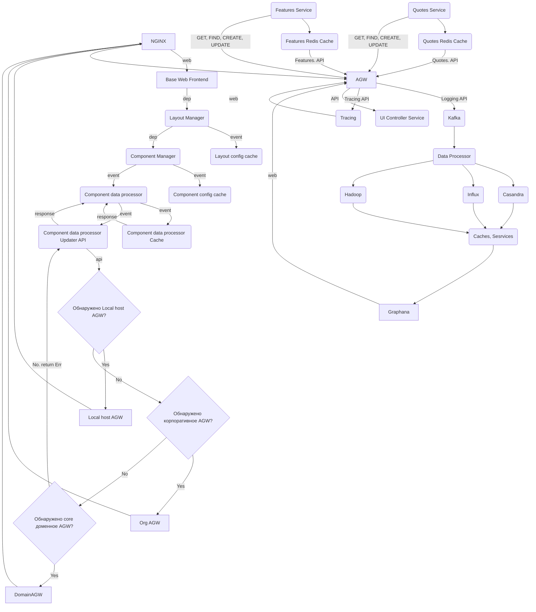
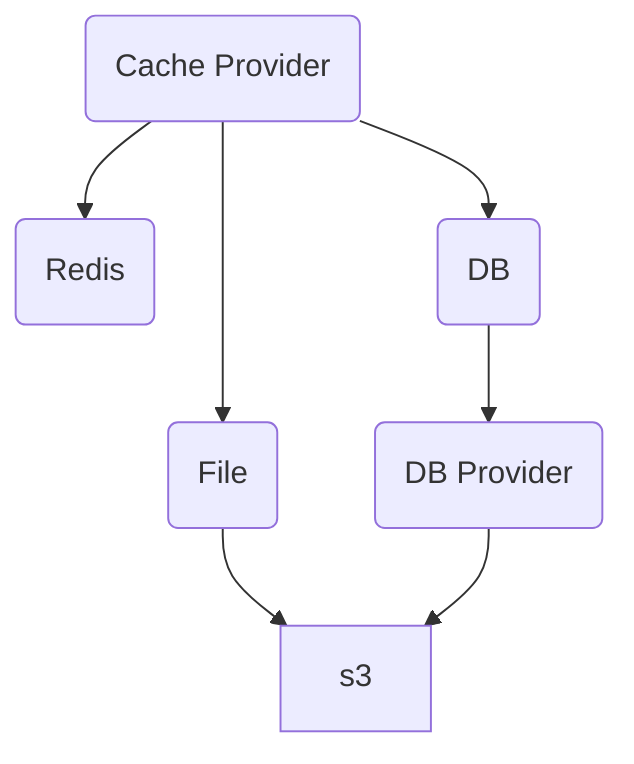

# PMCF Server

```mermaid
flowchart TB

NGINX -->|web| BWF
BWF[Base Web Frontend] -->|dep| BWFLM(Layout Manager)
BWFLM -->|event| BWFLCCC(Layout config cache)
BWFLM -->|dep| BWFCM(Component Manager)
BWFCM -->|event| BWFCMCC(Component config cache)
BWFCM -->|event| BWFCDP(Component data processor)
BWFCDP -->|event| BWFCDPC(Component data processor Cache)
BWFCDPC -->|response| BWFCDP
BWFCDP -->|event| BWFCDPU(Component data processor Updater API)
BWFCDPU -->|response| BWFCDP

BWFCDPU -->|api| LHAGWIDATAE{Обнаружено Local host AGW?}
LHAGWIDATAE -->|Yes| LHAGW[Local host AGW]
LHAGW --> NGINX
LHAGWIDATAE -->|No| OAGWIDATAE{Обнаружено корпоративное AGW?}
OAGWIDATAE -->|Yes| OAGW[Org AGW]
OAGW --> NGINX
OAGWIDATAE -->|No| isDomainAGW{Обнаружено core доменное AGW?}
isDomainAGW -->|Yes| DomainAGW
isDomainAGW -->|No. return Err| BWFCDPU
DomainAGW --> NGINX
NGINX --> AGW


AGW -->|Logging API| LoggingKafka(Kafka)
LoggingKafka --> LoggingDataProcessor(Data Processor)
LoggingDataProcessor --> LoggingCasandra(Casandra)
LoggingDataProcessor --> LoggingInflux(Influx)
LoggingDataProcessor --> LoggingHadoop(Hadoop)
LoggingCasandra --> LoggingCS(Caches, Sesrvices)
LoggingInflux --> LoggingCS
LoggingHadoop --> LoggingCS
LoggingCS --> Graphana
Graphana -->|web| AGW


AGW -->|Tracing API| Tracing(Tracing)
Tracing -->|web| AGW

QuotesCache(Quotes Redis Cache) -->|Quotes. API| AGW
QuotesService(Quotes Service) --> QuotesCache
QuotesService -->|GET, FIND, CREATE, UPDATE| AGW

FeaturesCache(Features Redis Cache) -->|Features. API| AGW
FeaturesService(Features Service) --> FeaturesCache
FeaturesService -->|GET, FIND, CREATE, UPDATE| AGW

AGW -->|API| UIC(UI Controller Service)
```

```mermaid
flowchart TB

CacheProvider(Cache Provider) --> CacheRedis(Redis)
CacheProvider --> CacheFile(File)
CacheFile --> s3
CacheProvider --> CacheDB(DB)
CacheDB --> DBProvider(DB Provider)
DBProvider --> s3
```
